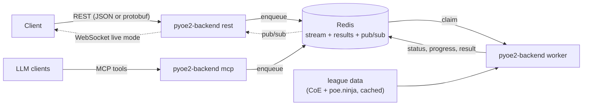

# pyoe2-craftpath backend

Cargo workspace containing the calculation engine, the wire contract, the
backend services and the Python bindings.

## Crates

| Crate | What it is |
|---|---|
| `crates/craftpath-core` | Pure calculation engine (item matrix propagation + route statistics). Feature `python` (non-default) adds the PyO3 class attributes. |
| `crates/craftpath-proto` | `prost`/`pbjson` types generated from [`/proto`](../proto) plus conversions to/from the domain types. One generated type serves both the binary protobuf and the canonical JSON encoding. |
| `crates/craftpath-server` | The `pyoe2-backend` binary: `rest` \| `worker` \| `mcp` \| `cli` modes. |
| `crates/pyoe2-craftpath` | Python package (maturin): native extension `pyoe2_craftpath._native` + pure-Python engine/client layer. |

## Services



- `pyoe2-backend rest` - API under `/api/v1`: `POST /jobs`, `GET /jobs/{id}`,
  `GET /jobs/{id}/result`, `DELETE /jobs/{id}`, `GET /jobs/{id}/ws` (live mode),
  `GET /presets`, plus `/healthz` `/readyz`. Bodies are negotiated between
  `application/json` and `application/x-protobuf` (see `/proto/craftpath/v1`).
- `pyoe2-backend worker` - claims jobs from the Redis stream (consumer group
  with crash recovery), one calculation per pod, progress/heartbeat flushed
  every 500ms, cooperative cancellation and wall-clock timeouts.
- `pyoe2-backend mcp` - Model Context Protocol server (streamable HTTP or
  stdio) with tools `submit_calculation`, `get_job_status`, `get_job_result`,
  `cancel_job`, `list_presets`.
- `pyoe2-backend cli` - the classic interactive CLI, unchanged.

### Run locally

```bash
docker run -d --rm -p 6379:6379 redis:7-alpine
cargo run -p craftpath-server -- worker &
cargo run -p craftpath-server -- rest
# submit a job:
curl -s -X POST localhost:8080/api/v1/jobs -H 'Content-Type: application/json' -d @job.json
```

Configuration is environment-driven: `REDIS_URL`, `BIND_ADDR`,
`POE2_LEAGUE_DEFAULT`, `JOB_TTL_SECS`, `JOB_TIMEOUT_SECS`,
`MAX_RAM_LIMIT_BYTES`, `CACHE_DIR`, `WORKER_HEALTH_ADDR`.

### Deploy

`docker build -f backend/Dockerfile .` from the repo root; Helm chart in
[`/deploy/helm/craftpath`](../deploy/helm/craftpath) (REST deployment +
ingress, CPU-autoscaled workers, optional MCP, single-node Redis or BYO).

## Python package

```python
import pyoe2_craftpath as pc

engine = pc.LocalEngine()                      # in-process (classic behavior)
engine = pc.RemoteEngine("http://backend")     # or: submit to the backend

result = engine.run(pc.JobSpec(start=..., target=..., league="Standard"))
print(result.pretty_text)
```

All classic classes (`Calculator`, `ItemSnapshot`, providers, presets, ...)
remain importable from `pyoe2_craftpath` unchanged. The remote client needs
`pip install 'pyoe2-craftpath[client]'`.

Tests: `cargo test --workspace` (Rust; set `REDIS_TEST_URL` for the queue
integration tests) and `python -m pytest python/tests` in
`crates/pyoe2-craftpath` (Python). Regenerate the committed proto code with
`scripts/gen_proto.sh`, the `.pyi` stub with `cargo run -p pyoe2-craftpath
--bin stub_gen`.

## 0.5.0 mechanics coverage & TODO

Cross-referenced 2026-06-11 against the CraftOfExile emulator/data, poe2wiki
and the poe.ninja exchange API (see `crates/craftpath-core/MECHANICS.md` for
sources and the full verification table).

**Modeled today:** transmutation/augmentation/regal/exalted/chaos (3 tiers,
0.5.0 thresholds), annulment, artificer, fracturing, vaal (sockets +
corruption implicits), desecration (bones + omens), essences
(standard/perfect/alloys), all dextral/sinistral omens, whittling, abyssal
echoes, greater exaltation, omen of light, homogenising (legacy),
omen of corruption (legacy).

**Implementable now (data already parsed or no data needed):**
- [ ] Divine Orb value rerolling - per-tier `nvalues` ranges already parsed
- [ ] Orb of Alchemy (`poe2_alchemy`: Normal/Magic → Rare with 4 mods)
- [ ] Runes + Soul Cores (+ Talismans) - `socketables` section already
      deserialized; ninja prices for runes/cores exist (talismans missing)
- [ ] Catalysts (value-quality on jewellery) - `catalysts` section +
      modifier `mtags`; ninja Breach prices incl. Refined variants
- [ ] Remaining emulator omens: Sinistral/Dextral Alchemy,
      Sinistral/Dextral Coronation, Greater Annulment, the Blessed
      (needs Divine), Blackblooded/Liege/Sovereign cross-check
- [ ] Hinekora's Lock as a "preview next result" policy action
- [ ] Alloy price source (absent from the poe.ninja exchange - official
      trade API or user-supplied)

**Waiting for CoE data:**
- [ ] Omen of Catalysing Exaltation (catalyst-quality weight multiplier -
      not in the emulator omen vocabulary yet)
- [ ] Omen of Sanctification / Sanctified items
- [ ] Vaal Catalysing Infuser (jewellery quality > 20%)
- [ ] Runeforging / Verisium / Genesis Tree (only Runeforged base items
      exist in `bitems`; no emulator actions yet)

**Refactor follow-ups:**
- [ ] Unify the per-propagator `pool.retain(...)` filter blocks onto
      `features/matrix/happy_path/pool_filter.rs` (one propagator per commit,
      matrix-hash goldens - each block has behavioral variations)
- [ ] Adopt `pool_filter::{pool_total_weight, acceptable_affix_weight}` in
      the remaining propagators (engine + exalted already share the logic)
- [ ] Drop the legacy path shims (`calc::*`, `external_api::*`,
      `api::types`-style re-exports) in the next major release

**Out of scope:** Jeweller's Orbs (support-gem sockets), Mirror, Orb of
Chance, quality currencies, Distilled Emotions, Starlit Ore;
Recombinator/Omen of Recombination (removed in 0.5.0).
