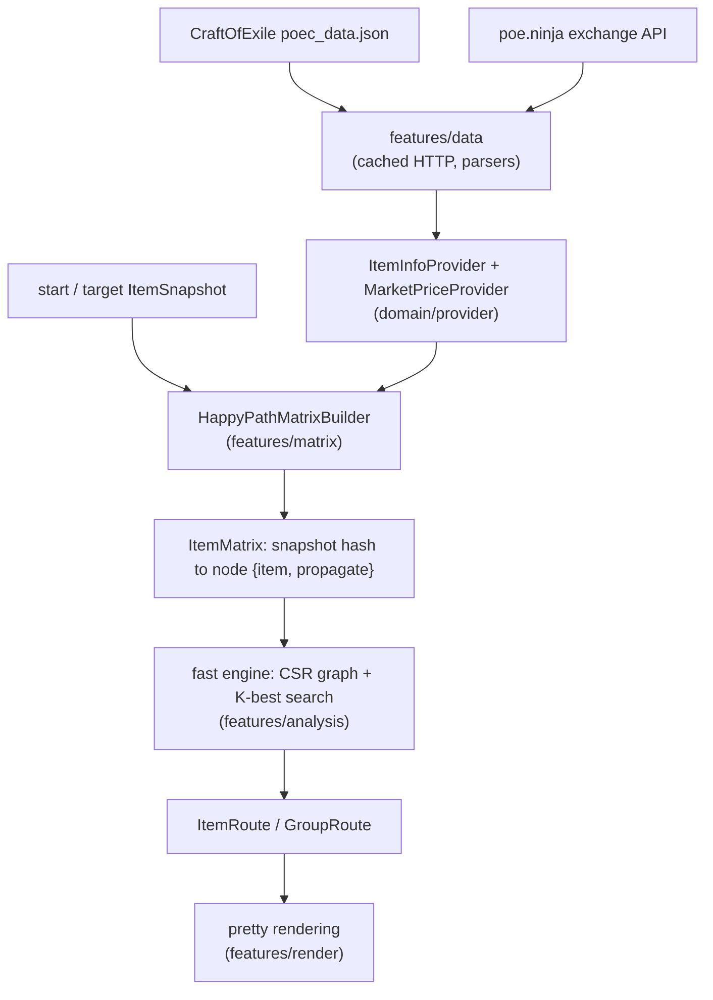
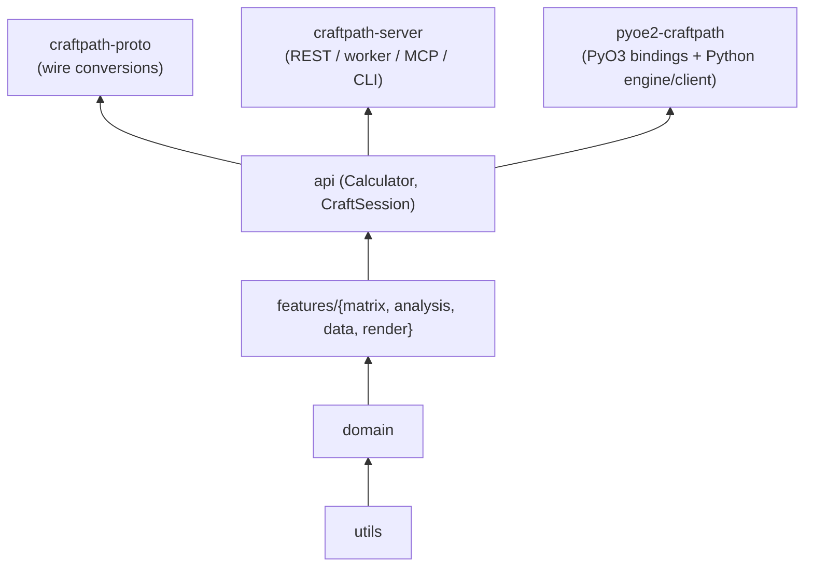

# Architecture: how CraftPath works

End-to-end walkthrough of a calculation, from game data to ranked craft
routes - the deeper companion to [[development-strategy]], which covers the
*why* behind the algorithmic constraints.

## Data flow

`craftpath-core` is layered one-way (each layer only depends on the ones
below it), and three consumer crates sit on top of its `api` facade
(`Calculator` orchestration + `CraftSession`):

## 1. Providers

`features/data` fetches and file-caches the CoE dataset (affix definitions,
per-base tier weight tables, essences/alloys, corruption implicits) and four
poe.ninja exchange feeds per league. Parsing fills two in-memory lookup
structures: `ItemInfoProvider` (affix/base/essence tables) and
`MarketPriceProvider` (prices in divines + exchange rates). Downloads that
return non-2xx are never cached; stale cache is used as fallback.

## 2. Matrix building

`HappyPathMatrixBuilder` runs wave propagation from the start snapshot. Each
wave, every registered propagator (one per currency family: transmutation …
vaal - see [[development-strategy]] for the happy-path constraint) proposes
`CraftCurrencyList → [PropagationTarget {next snapshot, exact Fraction
chance}]` branches for each frontier item. Duplicate outcomes keep only the
cheapest branch; states are deduplicated by snapshot hash. The result is a
digraph of item states, *mostly* layered by `target_proximity` (distance to
target in affixes+sockets) but with same-layer edges and genuine cycles
(chaos/annulment remove-and-re-add loops, temporary essence steps).

Per-branch configuration happens here: `CalculationConfig.disabled_currencies`
filters branches whose currency list contains an excluded currency (e.g. the
0.5.0-unobtainable legacy omens) right after each `propagate_step`.

## 3. Route search (the fast engine)

`features/analysis/engine` snapshots the matrix once into a CSR adjacency
(`CraftGraph`): per edge it resolves the f64 chance, the currency-list price
in Exalted (memoized per distinct list), and keeps references for route
reconstruction. Edges are deterministically ordered.

Three metrics, two algorithms:

- **Chance** (maximize product) and **cost** (minimize sum) are
  edge-decomposable and monotone (extending a path never improves them), so
  Dijkstra's settle argument holds directly - no log transforms. **Yen's
  algorithm** on top yields the K best *loopless* paths exactly:
  O(K·V·(E + V log V)).
- **Efficiency** = `cost × tries60(chance)` with
  `tries60(c) = max(1, ⌈ln 0.4 / ln(1−c)⌉)` is *not* edge-decomposable, but
  it is a function of two decomposable accumulators. The engine runs a
  **bi-criteria label-setting search**: labels `(cost, chance)` processed in
  ascending-cost order (edge costs are clamped > 0, so popped labels are
  final), pruned per node by *K-dominance* (a label survives unless ≥ K
  settled labels dominate it on both axes - an exchange argument makes this
  exact). Cycles never survive: a looping path is strictly cost-dominated by
  its simple reduction. A per-node frontier cap is the only inexact knob,
  exact whenever frontiers fit.

Final route weights are recomputed once per emitted route through the same
weight functions the exhaustive collector used, so outputs are bit-identical
to the legacy engine. The exhaustive all-path collector survives as the
`UniquePathChanceMemoryHeavy` preset - both the "enumerate everything" mode
and the equivalence-test oracle. Group statistics (currency-sequence
aggregation) still run on the exhaustive enumeration; porting them onto the
graph is an open follow-up.

## 4. Results, rendering, surfaces

`ItemRoute` carries the step list (matrix ids + exact `Fraction` chances +
currency lists), a weight and total chance; `GroupRoute` aggregates per
currency sequence. Pretty strings are rendered server-side
(`features/render`) because they need provider data and the matrix.

The same calculation is reachable through four surfaces:

- **Rust**: `Calculator::*` or the `CraftSession` facade
  (providers + config + progress bundled; `api/session.rs`).
- **Python**: `LocalEngine` (in-process via PyO3, GIL released during
  calculation, Ctrl-C cancels cooperatively) or `RemoteEngine`
  (httpx + websockets + protobuf against a backend).
- **REST**: `craftpath-server rest` - jobs on a Redis stream with queue
  position, worker pods compute (`craftpath-server worker`), WebSocket live
  progress; JSON and protobuf bodies are interchangeable (one pbjson type
  serves both).
- **MCP**: `craftpath-server mcp` exposes submit/status/result/cancel/presets
  as tools for LLM clients.

Long-running work reports through the `ProgressSink` trait (CLI spinner,
Redis progress hash, Python signal checks) and honours cooperative
cancellation and a RAM budget.

## Where this fits

- [[development-strategy]] - the happy-path constraint, caveats, extension
  points
- [[how-to-run]] - practical usage of each surface
- `backend/crates/craftpath-core/MECHANICS.md` - game-mechanics verification
  table (sources: CoE emulator/data, poe2wiki, poe.ninja)
