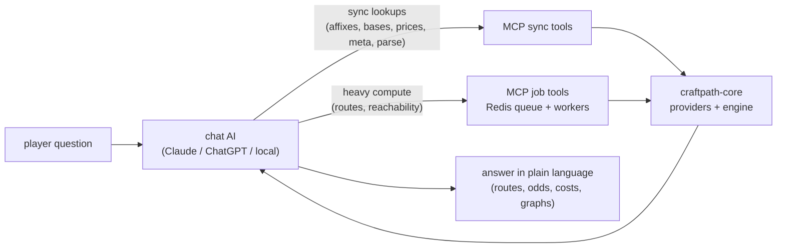

# MCP chat use-cases: what players ask and what answering takes

The persona-tiered catalog of questions a PoE2 player should be able to ask a
chat AI wired to the CraftPath MCP server, and, per question, the pipeline that
answers it plus the capabilities it requires. This page is the product-side
companion to [[mcp-capability-roadmap]], which consolidates the implied MCP
tool surface, engine gaps and phasing; engine internals live in
[[architecture]] and [[development-strategy]].

Status legend: **works today** (current 5-tool MCP server answers it),
**partial** (core machinery exists, tool surface or glue missing), **new**
(requires new capability; the roadmap page says which).

## How a chat request flows

The chat model does language and orchestration; the server does deterministic
math, ID resolution and caching (see "Client AI strategy" in
[[mcp-capability-roadmap]]).

## Beginner

### B1 "I just picked this up - is it any good?"

Player pastes in-game item text. Pipeline: `parse_item` -> affix explanations
via `search_affixes` -> comparison against `get_meta_items` archetypes.
**Partial**: only CoE-emulator JSON import exists today; needs the in-game
clipboard parser, the lookup tools and meta data.

### B2 "What does Essence of the Body do? When should I use essences?"

Pure metadata lookup: `search_affixes(affix_class=essence)` over the essence
tables already cached in `ItemInfoProvider`. **Partial**: data is in memory,
no tool exposes it.

### B3 "Why can't I add another mod to my bow?"

`get_legal_actions` explains the rule that blocks the player (rarity ceiling,
`max_affix`, prefix/suffix split) and lists which currencies are legal next
and what each would do. **New** (cheap: wraps `sanity_check_item` +
`BaseGroupDefinition` + propagator legality).

### B4 "I have 5 exalts - how can I improve my bow?"

Budget reachability with exalt-to-divine conversion (exchange rates already
cached): `submit_reachability(start, budget)` over candidate templates.
**New** (Phase 4).

### B5 "Should I buy a better bow or keep crafting mine?"

Craft-vs-buy: reachability expected cost vs `get_item_price_estimate` from
trade listings. **New** (Phase 4; price tool is feature-flagged).

### B6 "I'm a level 30 Ranger - what weapon should I be using?"

`get_meta_items(level_bracket="leveling", char_class="Ranger")`. **New**
(meta provider; static archetype JSON in v1).

### B7 "If I desecrate this item, what affixes can I get?"

`simulate_action(item, desecrate)` returns the one-step outcome distribution;
`search_affixes(affix_class=desecrated)` lists the pool for the base group.
**Partial**: the desecration propagator computes exactly this; no tool
exposes a single step.

### B8 "Which crafting steps are dangerous or not reversible?"

Per-step risk classification: vaal/corruption = irreversible, fracturing =
permanent, chaos = full reroll loses progress, annulment = can brick the
item. Deterministic currency-property table, surfaced in `get_legal_actions`
and as annotations on every returned route. **New** (cheap).

## Regular gamer

### R1 "I want a good bow - what is currently good?"

`get_meta_items(item_class="bow", char_class?, level?)`: ranked affix
archetypes with popularity, typical tiers and price bands. **New** (meta
provider; the original seed use case).

### R2 "I have a bow with X - what good enchant can I get with 2 divines on average?"

`parse_item` -> candidate "good" affixes from meta or the user -> 
`submit_reachability(start, budget_divines=2, candidate_templates)` returns
per outcome the expected cost and the chance of success within budget.
**New** (Phases 2-4; the original seed use case).

### R3 "How do I craft a +2 arrows / attack-speed bow, step by step?"

Name-to-ID lookups -> target template -> existing route calculation with
pretty-printed steps. **Partial**: the route engine and pretty rendering
exist; needs lookup tools and fuzzy targets.

### R4 "If I exalt-slam this right now, what are the odds of something good?"

`simulate_action(item, exalted_orb)`: one-step outcome distribution grouped
by affix. **Partial**: propagators compute it; tool is new.

### R5 "What's the divine-to-exalt rate? What does a Perfect Jeweller's cost?"

`get_currency_prices`: the cached `MarketPriceProvider` exposed as a tool.
**Partial** (trivial).

### R6 "Which omen protects my prefixes if I chaos this?"

`get_legal_actions(item)` filtered to omen interactions on the concrete item.
**New** (rides on B3).

### R7 "I have a bow with affixes X - what affixes would you recommend adding?"

`parse_item` -> `recommend_affixes(item, char_class?)`: server filters to
what is still rollable on *this* item (open prefix/suffix slots, exclusive
groups, base legality, all in `ItemInfoProvider`), ranking context comes from
meta data or PoB stat weights LLM-side; optionally each suggestion annotated
with cost-to-add via `simulate_action`/`submit_reachability`. **New**.

### R8 "I have two exalted orbs - what is the best I can get?"

Inventory-constrained reachability: budget expressed as owned currency
instead of divines. v1 converts the inventory to divine value and restricts
the action alphabet to the owned set; v2 enforces exact step counts (at most
two slams). **New**.

### R9 "Show me a graph of the three best items I can get"

`get_job_result(format="mermaid")` renders the top-N routes as a Mermaid
flowchart (start item -> currency steps with chances -> outcome items); chat
clients render Mermaid natively. **New** (cheap: rendering only).

### R10 "When should I apply the desecration step?"

Optimal ordering is already encoded in returned routes; needs structured
per-step metadata in `get_job_result(format="json")` (affix count at each
step, branch chances) so the LLM can explain *why* the step sits where it
does instead of guessing. **Partial**.

### R11 "When should I apply a quality increase?"

**Honest gap**: quality and catalysts are not part of `ItemSnapshot` or any
propagator. v1 answers from a static heuristic (quality does not affect affix
outcomes in most cases; apply it when the item is otherwise finished, or
while cheap if flipping) with the model gap disclosed. Engine support is a
stretch item (roadmap Phase 5).

### R12 "Where am I in the queue currently?"

**Works today**: `get_job_status` already returns state and
`queue_position`; this entry documents the phrasing-to-tool mapping.

### R13 "Follow this calculation / tell me when it's done"

`await_job(job_id, timeout_seconds)`: long-poll that returns on state change
or timeout so the client does not spam `get_job_status`; MCP progress
notifications where the client supports them. **New** (cheap).

### R14 "What is the calculation doing right now?"

Live progress: workers publish structured progress to Redis (phase = matrix
wave N / analyzing, frontier size, nodes expanded, RAM in use, routes found
so far, rough ETA), surfaced through `get_job_status`/`await_job` and the
existing WebSocket endpoint for the future frontend. **New** (worker
instrumentation).

## Pro

### P1 "I want a bow with EPPSSA / E1P1P2S1SA"

`parse_craft_spec` deterministically expands the spec (grammar in
[[mcp-capability-roadmap]]) into a target template, reports validation errors
and the concrete-target fan-out; the LLM pins wildcard slots via
`search_affixes` if the fan-out is too large, then submits the calculation.
**New** (parser + fuzzy targets; the original seed use case).

### P2 "I play Amazon - what BIS item can I craft with a budget of 1 divine?"

Deliberately LLM-orchestrated, not a server-side global search:
`get_meta_items(char_class="Amazon")` -> pick 1-3 slot archetypes ->
`submit_reachability` per archetype -> optionally `get_item_price_estimate`
for craft-vs-buy -> synthesized recommendation. **New** (composition of R1 +
R2; the original seed use case).

### P3 "Essence-spam vs chaos-spam vs desecrate-reroll: expected cost and variance?"

Currency-group statistics already aggregate routes by currency sequence; add
a `restrict_currencies` parameter so each strategy is evaluated with its own
action alphabet, then compare. **Partial**.

### P4 "Is fracturing worth it here - odds it locks the right mod, and the route EV after?"

The fracturing orb is modeled; needs per-branch outcome reporting on routes
(which fracture outcomes lead where, at what cost). **Partial**.

### P5 "I'm crafting 20 bows to sell - expected profit per craft?"

Reachability expected cost x `get_item_price_estimate` of the finished
template = expected margin; multiply out by batch size LLM-side. **New**
(rides on R2 + B5).

### P6 "Here's my PoB build code - which craft maximizes DPS per divine spent?"

`import_pob_build` decodes the share code (class, level, equipped items),
then candidate outcomes are scored by build impact: stat weights first, a
headless PoB DPS oracle as a stretch. **New**; discussion points in
[[pathofbuilding-poe2]].

## Coverage summary

| Tier | Works today | Partial | New |
|------|-------------|---------|-----|
| Beginner (B1-B8) | - | B1, B2, B7 | B3-B6, B8 |
| Regular (R1-R14) | R12 | R3-R5, R10 | R1-R2, R6-R9, R11 (gap), R13-R14 |
| Pro (P1-P6) | - | P3, P4 | P1, P2, P5, P6 |

Everything in the "new" column maps to a concrete tool or engine item in
[[mcp-capability-roadmap]]; nothing requires training a model or a second AI.
